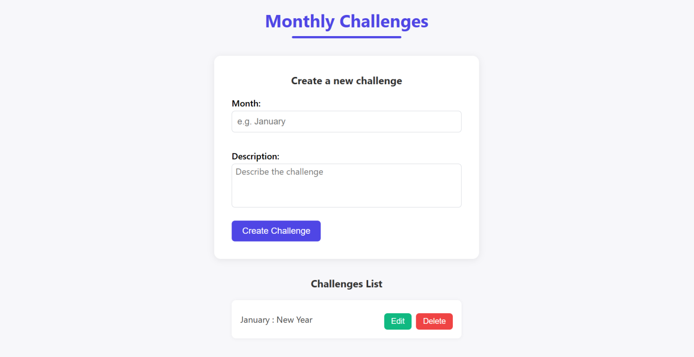

>>>>>>> 9bfe65b8aca9e0dfcf14351a9772fda8fa9746c6
## Quick Start

### Backend
```bash
cd MonthChallenges/
mvn spring-boot:run
```

### Frontend
```bash
cd Frontend/frontend/
npm install
npm run dev
```

<<<<<<< HEAD
The application will be available at:
- Frontend: `http://localhost:5173`
- Backend API: `http://localhost:8080`
                                                        
                                                    
## API Endpoints

- `GET /api/challenges` - Get all challenges
- `POST /api/challenges` - Create new challenge
- `PUT /api/challenges/{id}` - Update challenge
- `DELETE /api/challenges/{id}` - Delete challenge
=======
The application will be available at `http://localhost:5173` (frontend) and `http://localhost:8080` (backend API).
>>>>>>> 9bfe65b8aca9e0dfcf14351a9772fda8fa9746c6
=======
# Month Challenges Project

A full-stack web application for managing monthly challenges with a React frontend and Spring Boot backend.

## Overview

This project provides a simple yet effective platform to create, track, and manage monthly challenges. Users can add ne w challenges, view existing ones, and mark them as complete.

## Tech Stack

### Backend (MonthChallenges/)
- **Framework**: Spring Boot 3.5.3
- **Language**: Java 21
- **Database**: MySQL with JPA/Hibernate
- **Dependencies**: Spring Web, Spring Data JPA, Lombok

### Frontend (Frontend/)
- **Framework**: React 19.1.0
- **Build Tool**: Vite
- **Language**: JavaScript/JSX

## Features

- Create new monthly challenges
- View all challenges in a list
- Mark challenges as complete
- Responsive web interface
- RESTful API backend

## Screenshots

### Main Interface


### Create New Challenge


### Challenge List View


## Usage

### Adding a Challenge
1. Click the "Add New Challenge" button
2. Fill in the challenge details (title, description, target date)
3. Click "Save" to add the challenge

### Managing Challenges
- View all challenges in the main dashboard
- Click on any challenge to view details
- Use the toggle to mark challenges as complete/incomplete
- Delete challenges using the delete button

## Quick Start

### Backend
```bash
cd MonthChallenges/
mvn spring-boot:run
```

### Frontend
```bash
cd Frontend/frontend/
npm install
npm run dev
```

The application will be available at:
- Frontend: `http://localhost:5173`
- Backend API: `http://localhost:8080`

## API Endpoints

- `GET /api/challenges` - Get all challenges
- `POST /api/challenges` - Create new challenge
- `PUT /api/challenges/{id}` - Update challenge
- `DELETE /api/challenges/{id}` - Delete challenge

=======
>>>>>>> 9bfe65b8aca9e0dfcf14351a9772fda8fa9746c6
## Quick Start

### Backend
```bash
cd MonthChallenges/
mvn spring-boot:run
```

### Frontend
```bash
cd Frontend/frontend/
npm install
npm run dev
```

<<<<<<< HEAD
The application will be available at:
- Frontend: `http://localhost:5173`
- Backend API: `http://localhost:8080`

## API Endpoints

- `GET /api/challenges` - Get all challenges
- `POST /api/challenges` - Create new challenge
- `PUT /api/challenges/{id}` - Update challenge
- `DELETE /api/challenges/{id}` - Delete challenge
=======
The application will be available at `http://localhost:5173` (frontend) and `http://localhost:8080` (backend API).

>>>>>>> 9bfe65b8aca9e0d                         fcf14351a9772fda8fa9746c6
